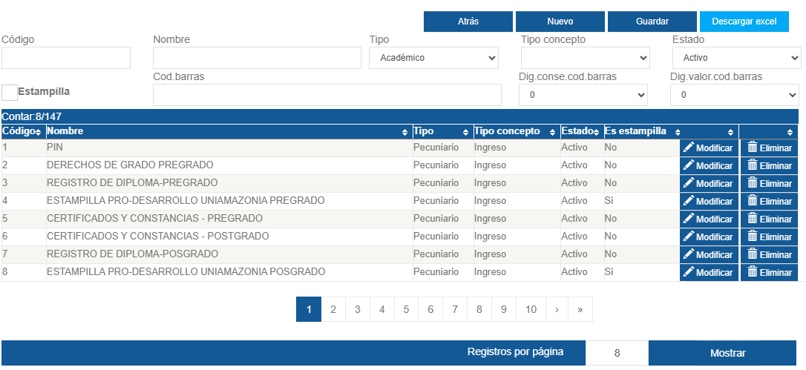
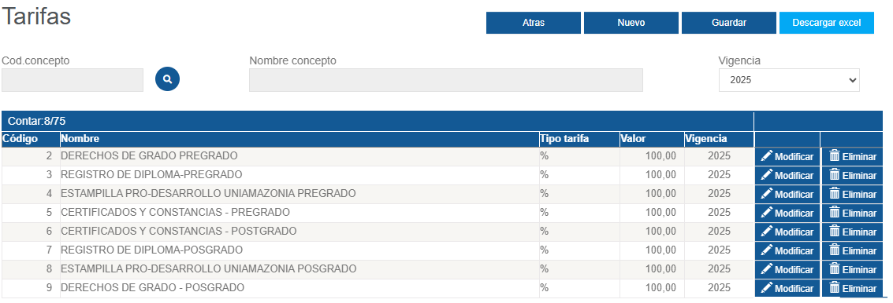

# Design Módulo de Liquidaciones

## 1. Empatizar
- Realizar entrevistas con usuarios clave (empleados que manejan la liquidacion, recaudo, clientes).
- Observar el proceso actual de liquidación y recaudo.
- Analizar datos sobre tiempos, costos y errores.

## 2. Definir
- Una vez recolectada la informacion de los usuarios el siguiente paso es definir el problema clave que debe ser resuelto.
- Ineficiencias, dificultad de uso, falta de integración, calidad de la informacion.

## 3. Idear
- Software altamente parametrizable, proceso automatizado, integrado.

## 4. Prototipar
- Formulario conceptos

- Formulario tarifas

## 5. Testear
- La idea es hacer la prueba con el usuario encargado de manejar el sistema y que conoce la logica del dominio y otro usuario que no para verificar que tan intuitivo, amigable o accesible es.
- Recoger retroalimentación.
- Ajustar la solución según comentarios.

